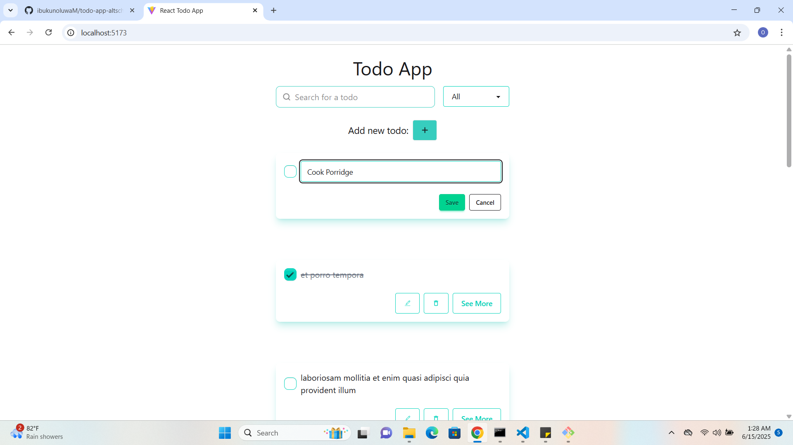
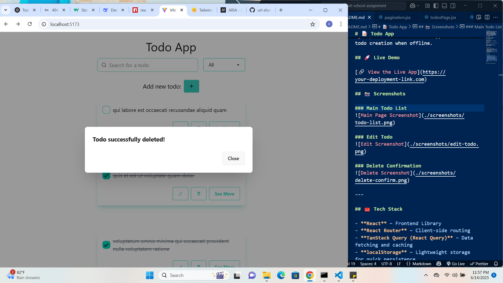
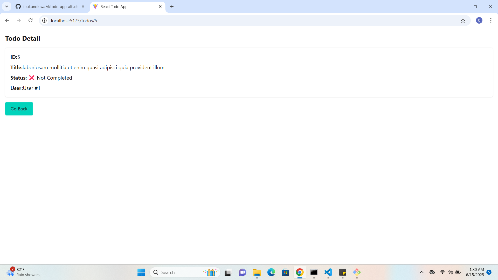

# 📝 Todo App

A full-featured Todo App built with React that supports **Create**, **Read**, **Update**, and **Delete** (CRUD) operations. It features pagination, edit in place, delete confirmation, offline support, and data persistence through `localStorage`. The app consumes the `jsonplaceholder` API and supports local todo creation when offline.

## 📸 Screenshots

### Main Todo List

### Edit Todo

### Delete Confirmation

### Dynamic URL of individual Todo details

---

## 🧰 Tech Stack

- **React** – Frontend Library  
- **React Router** – Client-side routing  
- **TanStack Query (React Query)** – Data fetching and caching  
- **localStorage** – Lightweight storage for quick persistence  
- **jsonplaceholder.typicode.com** – Public fake REST API  

---

## 🔧 Features

- ✅ Add todos (with form and modal)  
- ✅ Edit todos in-place  
- ✅ Delete todos (with confirmation modal)  
- ✅ Checkbox toggle for completion  
- ✅ Pagination (10 todos per page)  
- ✅ Caching API response using localForage  
- ✅ Offline capability using Dexie.js  
- ✅ Merge local and remote todos on load  
- ✅ Filter out deleted todos using local tracking  
- ✅ Error Boundary for catching unexpected crashes  

---

## 🧪 Error Boundary

The app uses a custom `ErrorBoundary` component to catch and display errors gracefully.  
A special route (e.g. `/test-error`) is provided to trigger an intentional error and demonstrate the boundary in action.

---

## Usage
Add a new todo using the form.

Click the edit button to rename a todo.

Click the delete button to remove a todo.

Use the pagination buttons to navigate.

If offline, add/edit/delete operations are stored locally and sync when back online.

##  Known Limitations
JSONPlaceholder API does not persist changes (for demonstration only).

Only local todos are truly persisted using localStorage.

👤 Author
Name: Ibukunoluwa Olateju

Cohort: AltSchool Africa, Frontend Engineering – 2025